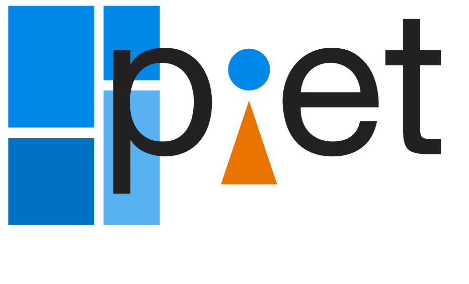

<div align="center">

# Piet

**A 2D graphics abstraction**

[](https://crates.io/crates/piet)
[](https://docs.rs/piet)
[](#license)

[](https://xi.zulipchat.com/#narrow/channel/259397-piet)
[](https://github.com/linebender/piet/actions)
[](https://deps.rs/repo/github/linebender/piet)

</div>

Cross-platform 2D graphics.

The Piet project consists of a core crate (`piet`) which describes a 2D graphics API,
and a number of "backends", which implement that API on top of the built-in
2D graphics system of a given platform. This allows the same drawing code to be
used on different platforms, without having to bundle a full 2D renderer.

The motivation for this crate is set forth in this [blog post]. It is used as
the basis of [Druid], a cross-platform GUI toolkit.

A companion for Bézier path representation and geometry is [kurbo].

## Getting started

Running the examples requires that submodules be checked out. From the root
directory, run

```sh
git submodule update --init
```

## Contributing

### Piet is in maintenance mode.

Piet has largely stabilized, and no major API additions are planned by the
original developers. Bug fixes and performance improvements are welcome.

If there is a significant feature you would like to add that can be discussed.
For a new feature to be considered, there must be a plan for how it would be
implemented in at least the coregraphics, direct2d, and cairo backends, and the
actual implementation should include support for at least two of these.

For questions and discussions we use a zulip chat instance at [xi.zulipchat.com][zulip]
under the #piet stream.

## Backends

*For cross-platform use, the [`piet-common`][] crate reexports the most
appropriate implementation for the current target.*

#### `piet-cairo` [](https://crates.io/crates/piet-cairo)

The `piet-cairo` crate depends on the [cairo library][]. A simple test of the cairo
backend is to run `cargo run --example test-picture 0` in the `piet-cairo` directory,
which should produce an image file called `cairo-test-00-2.00.png`.

#### `piet-coregraphics` [](https://crates.io/crates/piet-coregraphics)

The `piet-coregraphics` crate works on macOS only. A simple test of the coregraphics
backend is to run `cargo run --example test-picture 0` in the `piet-coregraphics` directory,
which should produce an image file called `coregraphics-test-00-2.00.png`.

#### `piet-direct2d` [](https://crates.io/crates/piet-direct2d)

The `piet-direct2d` crate works on Windows only. A simple test of the direct2d
backend is to run `cargo run --example test-picture 0` in the `piet-direct2d` directory,
which should produce an image called `d2d-test-00-2.00.png`.

#### `piet-svg` [](https://crates.io/crates/piet-svg)
#### `piet-web` [](https://crates.io/crates/piet-web)

## Minimum supported Rust Version (MSRV)

This version of Piet has been verified to compile with **Rust 1.77** and later.

Future versions of Piet might increase the Rust version requirement.
It will not be treated as a breaking change and as such can even happen with small patch releases.

<details>
<summary>Click here if compiling fails.</summary>

As time has passed, some of Piet's dependencies could have released versions with a higher Rust requirement.
If you encounter a compilation issue due to a dependency and don't want to upgrade your Rust toolchain, then you could downgrade the dependency.

```sh
# Use the problematic dependency's name and version
cargo update -p package_name --precise 0.1.1
```

</details>

## Community

Discussion of Piet development happens in the [Linebender Zulip](https://xi.zulipchat.com/), specifically the [#piet stream](https://xi.zulipchat.com/#narrow/channel/259397-piet).
All public content can be read without logging in.

Contributions are welcome by pull request.
The [Rust code of conduct] applies.

Unless you explicitly state otherwise, any contribution intentionally submitted for inclusion in the work by you, as defined in the Apache 2.0 license, shall be licensed as noted in the [License](#license) section, without any additional terms or conditions.

## Inspirations

Piet's interface is largely inspired by the [Skia Graphics Library] as well as the [C++ 2D graphics api proposal] although piet aims to be much more lightweight and modular.

## The Name

The library is named after [Piet Mondrian]. It is abstract and intended to be used for drawing lots of rectangles.

## License

Licensed under either of

- Apache License, Version 2.0 ([LICENSE-APACHE](LICENSE-APACHE) or <http://www.apache.org/licenses/LICENSE-2.0>)
- MIT license ([LICENSE-MIT](LICENSE-MIT) or <http://opensource.org/licenses/MIT>)

at your option.

[blog post]: https://raphlinus.github.io/rust/graphics/2018/10/11/2d-graphics.html
[Druid]: https://github.com/xi-editor/druid
[kurbo]: https://github.com/linebender/kurbo
[zulip]: https://xi.zulipchat.com
[Skia Graphics Library]: https://skia.org
[C++ 2D graphics api proposal]: http://www.open-std.org/jtc1/sc22/wg21/docs/papers/2018/p0267r8.pdf
[Piet Mondrian]: https://en.wikipedia.org/wiki/Piet_Mondrian
[`piet-common`]: https://crates.io/crates/piet-common
[cairo library]: https://www.cairographics.org/download/
[Rust code of conduct]: https://www.rust-lang.org/policies/code-of-conduct
